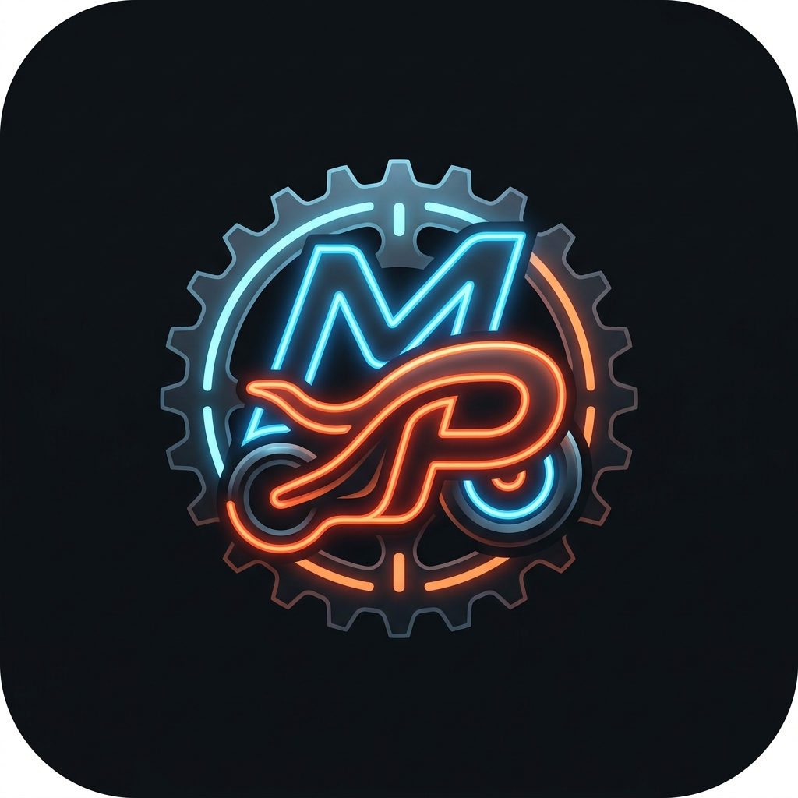

# 🏍️ Moto Parts - Sistema de Inventario y Punto de Venta

¡Hola! Desarrollé este sistema full-stack como una solución a medida para ayudar a mi papá a administrar el negocio familiar de repuestos de motos. Mi objetivo principal fue crear una herramienta que fuera robusta por detrás, pero extremadamente intuitiva y fácil de usar en el día a día, permitiéndole llevar el control del local sin fricciones tecnológicas.



## 🚀 Características Principales

Decidí enfocarme en resolver los problemas reales de un mostrador, manteniendo la interfaz lo más limpia posible:

- **📊 Dashboard Estadístico:** Un resumen en tiempo real del valor total del inventario y alertas automáticas cuando un repuesto se está quedando sin stock.
- **📦 Gestión de Inventario:** ABM (Alta, Baja y Modificación) de productos, con búsqueda rápida por código SKU, nombre o categoría.
- **🛒 Punto de Venta (POS):** Un módulo de caja con carrito de compras que descuenta automáticamente el stock de la base de datos al confirmar una venta. Evita vender productos agotados.
- **🧾 Historial de Ventas:** Registro inalterable de cada transacción realizada con su fecha, total y detalle de artículos.
- **📱 PWA Instalable:** Configuré el frontend como una Progressive Web App. Esto permite que el sistema se instale como una aplicación nativa en el escritorio de Windows o en el celular, abriéndose con un doble clic sin necesidad de escribir URLs.

## 🛠️ Tecnologías Utilizadas

Para este proyecto elegí un stack moderno que me permitiera desarrollar rápido y mantener un alto rendimiento:

**Backend:**
- **C# / .NET 8 Web API:** Para construir una API RESTful segura y tipada.
- **Entity Framework Core:** Como ORM para interactuar con la base de datos.
- **SQLite:** Elegí SQLite por su portabilidad. No requiere que mi papá instale pesados motores de bases de datos (como SQL Server) en la computadora del local; la base de datos vive en un simple archivo local.

**Frontend:**
- **React.js + Vite:** Para una experiencia de usuario fluida (Single Page Application) y tiempos de compilación ultrarrápidos.
- **CSS Vanilla (Custom Properties):** Diseñé toda la interfaz desde cero usando variables CSS y flexbox/grid, creando un modo oscuro elegante sin depender de librerías de componentes pesadas.

## ⚙️ Cómo ejecutar el proyecto localmente

Si quieres probar el sistema en tu máquina, sigue estos pasos:

### 1. Iniciar el Backend (.NET)
Abre una terminal en la carpeta principal del proyecto (`InventarioApi`):
```bash
# Aplica las migraciones a la base de datos SQLite
dotnet ef database update

# Levanta el servidor backend (se ejecutará por defecto en el puerto 5190)
dotnet run
```

### 2. Iniciar el Frontend (React)
Abre otra terminal y navega a la carpeta del panel:
```bash
cd panel-moto-parts

# Instala las dependencias
npm install

# Inicia el entorno de desarrollo de Vite (se ejecutará en el puerto 5173)
npm run dev
```

Visita `http://localhost:5173` en tu navegador y ya podrás usar el sistema.

---
*Desarrollado con dedicación para simplificar el trabajo de todos los días.*
